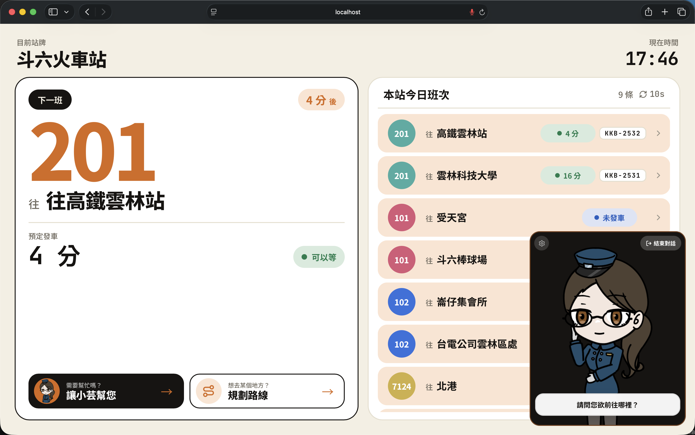

# taigi-agent

雲林縣公車站牌的資訊服務機（Kiosk）系統，雲林科技大學實務專題。螢幕顯示所在站牌每條路線目前的狀態；使用者也可以用台語發問，由數位站務員「小芸」用台語回答。



主要功能：

- 離站首頁：每條路線、每個方向顯示即將到站、可以等、等待較久、尚未發車或末班已過。
- 台語語音問答：例如「201 幾分鐘到」「我要去虎尾」。
- 地圖路線規劃：在地圖上選目的地，顯示候選路線。
- 後台 `/admin`：設定 Kiosk 所在的站牌與方向。

到站資料來自交通部 TDX。到站時間、方向與末班狀態由程式查詢與判斷，語言模型負責理解問題，並把查詢結果寫成回答。流程與限制見 [架構](docs/architecture.md)。

## 本機啟動

```bash
cp backend/.env.example backend/.env   # 填 LLM_BASE_URL、LLM_MODEL、TDX_CLIENT_ID、TDX_CLIENT_SECRET、ADMIN_TOKEN
brew install process-compose           # 只需一次
process-compose up backend frontend    # 安裝依賴，啟動後端與前端
```

啟動後開啟 Vite 顯示的網址。路線規劃、觀測、模型服務與其他啟動方式見 [本地開發](docs/deployment/local-development.md)；正式環境見 [正式部署](docs/deployment/production.md)。

## 文件

| 文件 | 內容 |
|---|---|
| [架構](docs/architecture.md) | 處理流程、工具、模組位置、限制 |
| [產品定位](docs/product-positioning.md) | 功能範圍與取捨、狀態定義 |
| [路線規劃](docs/route-planning.md) | 地圖路線規劃與 OTP |
| [TDX 方案與限流](docs/tdx-tiers.md) | TDX 計費方案、限流與快取 |
| [觀測](docs/observability.md) | OpenTelemetry 與 SigNoz |
| [開發紀錄](docs/changelog.md) | 已完成、未完成與不做的項目 |
| [架構參考](docs/architecture-reference.md) | 各模組的職責與注意事項 |
| [CLAUDE.md](CLAUDE.md) | AI agent 作業規範 |
