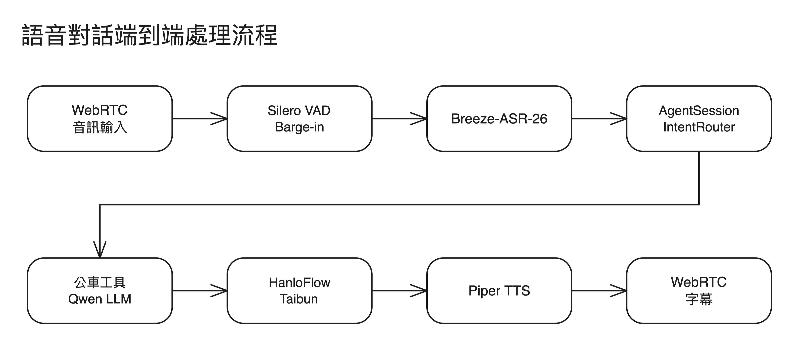

# 一句話怎麼變成答案

先看一個例子。使用者對 Kiosk 說：「**201 幾分鐘到？**」

| 步驟 | 誰做 | 手上的資料（示意） |
|---|---|---|
| 1. 抓到「說完了」 | Silero VAD | 一段音訊；說話途中被打斷也能停下（barge-in） |
| 2. 聽成文字 | Breeze-ASR-26 | `"201 幾分鐘到"` |
| 3. 判斷怎麼處理 | `IntentRouter` | 不是打招呼，交給 LLM |
| 4. 決定查什麼 | Qwen3.5-4B（LLM） | 呼叫 `get_arrivals_here(route="201")` |
| 5. 查資料 | 工具 → TDX | `往高鐵雲林站：7 分鐘後到` |
| 6. 說成一句話 | LLM | 「201 往高鐵雲林站，七分鐘後到。」 |
| 7. 變台語 | HanloFlow + Taibun | 國語句子 → 台語拼音 |
| 8. 發聲 | Piper TTS（自行微調） | 台語語音 |

## 核心想法：工具查，模型說

第 5 步的數字是程式算的，第 6 步的模型只改寫。

- **只靠模型**：它會編出一個聽起來合理的時間。
- **工具先算好**：時間、方向、末班都是真的，模型最多把話說得不自然。

聽錯也是這樣處理：ASR 把「201」聽成「兩洞一」時，工具查不到會回幾個相近的路線，模型用確認句問使用者，不會硬猜。

## 工具清單

`get_arrivals_here`（某路線到站）、`get_stop_arrival_statuses_here`（本站全部路線）、`get_routes_at_stop_here`（本站有哪些路線）、`get_route_stops`（路線停哪些站）、`get_arrivals_to_destination`（去某地搭哪條）、`check_stop_on_route`（某路線停不停某站）。

## 名詞

| 詞 | 意思 |
|---|---|
| Kiosk | 站牌旁的立式觸控螢幕，固定在一個站牌，只回答這一站的事 |
| 離站決策 | 一條路線「現在可不可以搭」：可搭、可以等、未發車、末班已過 |
| 工具（tool） | 給模型呼叫的函式，回傳一段文字 |
| provider | 外部資料的接口，例如 TDX。換資料源只改這一層 |
| TDX | 交通部公共運輸整合資訊流通服務，唯一的公車資料來源 |
| VAD | 偵測「人現在有沒有在說話」，用來判斷何時說完、何時被打斷 |
| IntentRouter | 用規則先攔掉固定問題（打招呼、道別），省掉一次 LLM 呼叫 |
| HanloFlow / Taibun | 把國語句子轉成台語漢字與拼音，TTS 才唸得出台語 |
| Piper | 開源 TTS 引擎，聲音模型是自己用台語資料微調的 |
| OTP | OpenTripPlanner，路線規劃用，只在地圖選點時才用到 |

## 程式在哪

| 資料夾 | 做什麼 |
|---|---|
| `backend/agent/` | 對話迴圈：訊息、呼叫 LLM、派送工具。不放公車邏輯 |
| `backend/tools/` | 給 LLM 的工具 |
| `backend/services/` | 公車領域邏輯：離站決策、路線規劃、Kiosk 設定 |
| `backend/providers/` | 外部資料：TDX、ASR、TTS、OTP |
| `backend/voice/` | WebRTC 語音，可打斷 |
| `backend/pipeline/` | 國語 → 台語文字 |
| `frontend/` | Vue 畫面：首頁、站務員、地圖、`/admin` |

想改什麼：

- **加一個查詢** → 在 `tools/` 寫工具，登記到 `agent/tools.py`
- **換站牌** → 開 `/admin`，不用改程式
- **換資料源** → 只改 `providers/tdx_bus.py`
- **改某個模組** → 先讀 [逐模組細節](architecture-reference.md)

## 限制

- TDX 是唯一資料來源。被限流或暫時連不上時，改用最近一次查到的資料（最多放約 6 分鐘）：「幾分鐘後到」會照現在的時間倒數，但這段時間的誤點看不到。再久就只會回「查詢失敗」。
- TDX 只告訴我們「還沒發車」，不給預計發車時刻，所以畫面上寫「未發車」但沒有時間。
- 不做完整時刻表、文字描述目的地的路線規劃。路線規劃走地圖。
